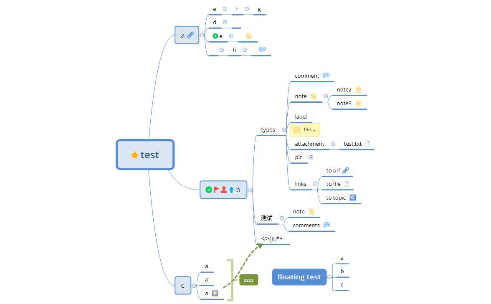

# xmindparser

[](https://pypi.org/project/xmindparser/)

Parse xmind file to programmable data type (e.g. json, xml). Python 3.x required.

See also: [xmind2testlink](https://github.com/tobyqin/xmind2testlink)

中文介绍：https://betacat.online/posts/2018-07-01/parse-xmind-to-programmable-data-type/

## Installation

```shell
pip install xmindparser
```

## Usage - Command Line

```shell
cd /your/xmind/dir

xmindparser your.xmind -json
xmindparser your.xmind -xml
```

Note: Parse to xml file type require [dicttoxml](https://pypi.org/project/dicttoxml/).

## Usage - via Python

```python
from xmindparser import xmind_to_dict

d = xmind_to_dict('/path/to/your/xmind')
print(d)
```

## Configurations

If you use `xmindparser` via Python, it provides a `config` object, see this example:

```python
import logging
from xmindparser import xmind_to_dict,config

config = {'logName': 'your_log_name',
          'logLevel': logging.DEBUG,
          'logFormat': '%(asctime)s %(levelname)-8s: %(message)s',
          'showTopicId': True, # internal id will be included, default = False
          'hideEmptyValue': False  # empty values will be hidden, default = True
          }

d = xmind_to_dict('/path/to/your/xmind')
print(d)

```

## Limitations

Please note, following xmind features will not be supported or partially supported.

- Will not parse Pro features, e.g. Task Info, Audio Note
- Will not parse floating topics.
- Will not parse linked topics.
- Will not parse summary info.
- Will not parse relationship info.
- Will not parse boundary info.
- Will not parse attachment object, only name it as `[Attachment] - name`
- Will not parse image object, only name it as `[Image]`
- Rich text format in notes will be parsed as plain text.

## Examples


[(Download this file)](tests/test.xmind)

- xmind to [json example](doc/example.json)
- xmind to [xml example](doc/example.xml)

## License

MIT
